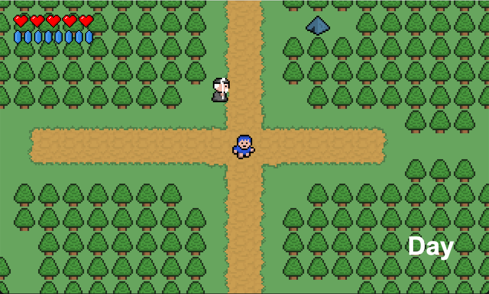

# Blue Boy Adventure  

  

## 🎮 About the Game  
**Blue Boy Adventure** is a 2D adventure game where you explore, fight monsters, interact with NPCs, and collect items. You control a player navigating a pixel-art world, battling foes like orcs and skeleton lords while equipping weapons and shields.  

## 🚀 Features  
- **🌍 Exploration** – Traverse a pixel-art world filled with NPCs and enemies.  
- **⚔️ Combat System** – Fight enemies like orcs and skeleton lords using melee attacks.  
- **🛡️ Equipment** – Collect weapons, shields, and potions to enhance your abilities.  
- **🎨 Pixel Art** – Enjoy a retro-inspired 2D game aesthetic.  
- **💾 Save & Load** – Progress is stored so you can continue your adventure anytime.  

## 🕹️ Controls  

Image Credits: [berkayw](https://github.com/berkayw/Blue-Boy-Adventure/commits?author=berkayw)

## 🛠️ Installation & Running the Game  
### Prerequisites  
- Ensure you have **Java** installed on your system.  

### How to Run  
1. **Download the repository**  
   - Click on the **Code** button at the top of this repository.  
   - Select **Download ZIP** and save the file to your computer.  

2. **Extract the ZIP file**  
   - Unzip the file and open the extracted folder.  

3. **Open the project in a code editor**  
   - Drag the folder into **VS Code**, **IntelliJ IDEA**, or another Java-supported editor.  

4. **Run the game using the terminal**  
   - Open a terminal in the project directory.  
   - Enter the following command:  
     ```sh
     java --class-path bin:res main.Main
     ```
   - Press **Enter**, and the game should start!  

## 🎥 Credits  
This game was developed with the help of the [RyiSnow Tutorial](https://www.youtube.com/playlist?list=PL_QPQmz5C6WUF-pOQDsbsKbaBZqXj4qSq).  